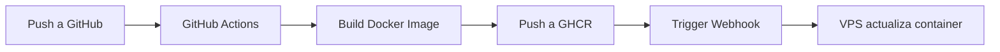

# 🚀 Guía de Despliegue en VPS con CI/CD

## Workflow de Despliegue



## Pasos de Configuración

### 1️⃣ Configurar Credenciales en GitHub

**No necesitas crear tokens, GitHub usa `GITHUB_TOKEN` automáticamente**

Solo asegúrate de que en los **settings del repositorio**:
- Ve a: Settings → Packages → Allow write access for GitHub Actions
- Esto permite a las acciones publicar en GHCR

### 2️⃣ Configurar Secretos en GitHub

En tu repositorio:

1. **Copia en GitHub**: Settings → Secrets and variables → Actions → New repository secret

```
Name: VPS_WEBHOOK_URL
Value: https://tudominio.com:9000/webhook
       (o tu IP + puerto)
```

**IMPORTANTE**: Esta URL debe ser accesible desde GitHub (pública o con firewall configurado)

### 3️⃣ Configurar la VPS

#### 3.1 Clonar el repositorio en la VPS

```bash
cd /opt
git clone https://github.com/angelporlan/ai-cv-generator.git ia-microservice
cd ia-microservice
```

#### 3.2 Crear archivo `.env` en la VPS

```bash
cp .env.example .env  # Si existe
# O crear manualmente:
cat > .env << 'EOF'
# Tu configuración
OPENROUTER_API_KEY=tu_key_aqui
PORT=3002
EOF
```

#### 3.3 Configurar el servidor de webhooks

**Opción A: Con Python (recomendado)**

```bash
# Hacer ejecutable
chmod +x scripts/webhook-handler-python.py

# Prueba manual:
WEBHOOK_SECRET=tu_secret_aqui PROJECT_DIR=/opt/ia-microservice python3 scripts/webhook-handler-python.py
```

**Opción B: Con Bash**

```bash
chmod +x scripts/webhook-handler.sh
./scripts/webhook-handler.sh
```

#### 3.4 Crear servicio systemd (para que corra automáticamente)

Crear archivo `/etc/systemd/system/docker-webhook.service`:

```ini
[Unit]
Description=Docker Webhook Handler
After=network.target docker.service
Requires=docker.service

[Service]
Type=simple
User=root
WorkingDirectory=/opt/ia-microservice
Environment="WEBHOOK_SECRET=tu_secret_aqui"
Environment="PROJECT_DIR=/opt/ia-microservice"
Environment="WEBHOOK_PORT=9000"
ExecStart=/usr/bin/python3 /opt/ia-microservice/scripts/webhook-handler-python.py
Restart=always
RestartSec=10

[Install]
WantedBy=multi-user.target
```

Luego:

```bash
sudo systemctl daemon-reload
sudo systemctl enable docker-webhook
sudo systemctl start docker-webhook
sudo systemctl status docker-webhook
```

### 4️⃣ Configurar Firewall y SSL

#### 4.1 Abrir puerto en firewall

```bash
sudo ufw allow 9000/tcp
```

#### 4.2 Configurar SSL con Nginx (proxy inverso)

No es recomendable exponer el servidor Python directamente. Usa Nginx como proxy:

```nginx
server {
    listen 443 ssl http2;
    server_name tudominio.com;

    ssl_certificate /etc/letsencrypt/live/tudominio.com/fullchain.pem;
    ssl_certificate_key /etc/letsencrypt/live/tudominio.com/privkey.pem;

    location /webhook {
        proxy_pass http://127.0.0.1:9000;
        proxy_set_header Host $host;
        proxy_set_header X-Real-IP $remote_addr;
        proxy_set_header X-Forwarded-For $proxy_add_x_forwarded_for;
        proxy_set_header X-Forwarded-Proto $scheme;
        
        # Headers de webhook
        proxy_pass_header X-Hub-Signature-256;
    }
}
```

### 5️⃣ Configurar Webhook en GitHub

1. Repositorio → Settings → Webhooks → Add webhook

```
Payload URL: https://tudominio.com/webhook
Content type: application/json
Secret: tu_secret_aqui (mismo que en systemd)
Events: Push events
Active: ✓
```

## 🧪 Testing

### Probar el webhook localmente

```bash
# Simular push a GitHub
curl -X POST http://127.0.0.1:9000/webhook \
  -H "Content-Type: application/json" \
  -d '{
    "image": "ghcr.io/angelporlan/ai-cv-generator:main",
    "sha": "abc123"
  }'
```

### Ver logs en la VPS

```bash
# Logs del servicio
sudo journalctl -u docker-webhook -f

# O ver archivo de log
tail -f /var/log/docker-webhook.log
```

### Ver logs de GitHub Actions

https://github.com/angelporlan/ai-cv-generator/actions

## 📋 Checklist Final

- [ ] Credenciales GitHub configuradas (GITHUB_TOKEN automático)
- [ ] Secreto `VPS_WEBHOOK_URL` agregado en GitHub
- [ ] Repositorio clonado en `/opt/ia-microservice`
- [ ] Archivo `.env` configurado en la VPS
- [ ] Servidor de webhooks corriendo (systemd service)
- [ ] Firewall permite puerto 9000 (o Nginx reverse proxy)
- [ ] SSL/HTTPS configurado
- [ ] Webhook de GitHub creado y activo
- [ ] Test de push realizado y contenedor actualizado

## 🔑 Variables de Entorno

En tu VPS, configurar en `/etc/systemd/system/docker-webhook.service`:

```bash
WEBHOOK_SECRET=tu_secret_seguro_aqui
PROJECT_DIR=/opt/ia-microservice
WEBHOOK_PORT=9000
LOG_DIR=/var/log
```

## 🚨 Troubleshooting

### Contenedor no se actualiza

1. Verificar logs del servicio:
   ```bash
   sudo journalctl -u docker-webhook -f
   ```

2. Verificar que la imagen está disponible:
   ```bash
   docker pull ghcr.io/angelporlan/ai-cv-generator:main
   ```

3. Verificar credenciales para GHCR:
   ```bash
   cat ~/.docker/config.json
   ```

### Webhook no llega a la VPS

1. Verificar que el servidor escucha:
   ```bash
   netstat -tlnp | grep 9000
   ```

2. Testear conexión desde GitHub (usando Actions):
   ```bash
   curl -X POST https://tudominio.com/webhook -d '{"test": true}'
   ```

3. Verificar firewall:
   ```bash
   sudo ufw status
   ```

## 📚 Referencias

- [GitHub Actions Docker Build & Push](https://github.com/docker/build-push-action)
- [GitHub Container Registry (GHCR)](https://docs.github.com/en/packages/working-with-a-github-packages-registry/working-with-the-container-registry)
- [Webhooks de GitHub](https://docs.github.com/en/developers/webhooks-and-events/webhooks)
